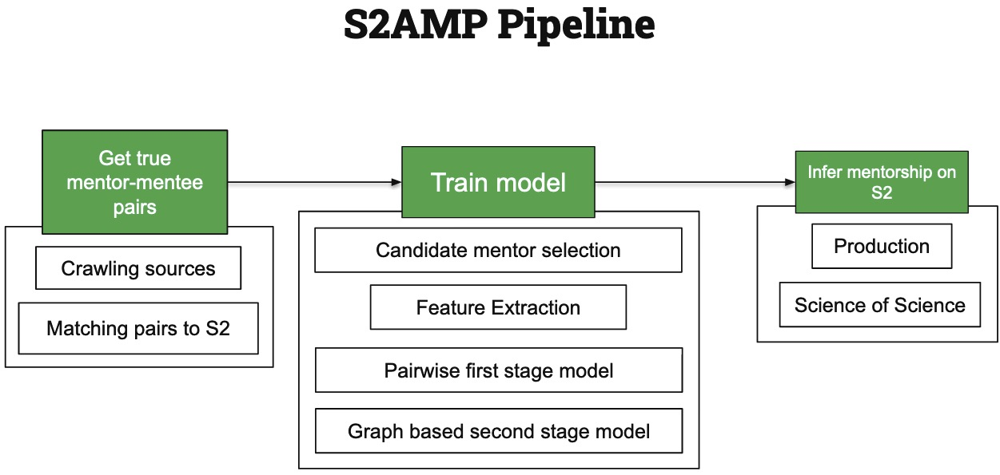
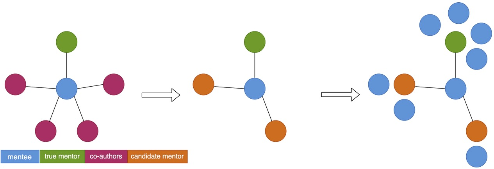
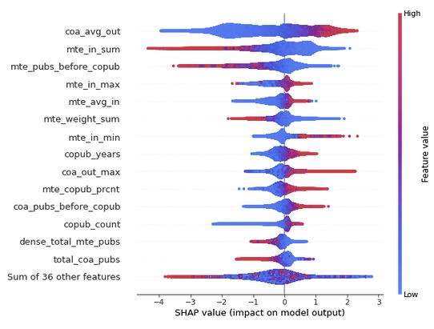

# S2AMP data
Dataset for S2AMP including training/classification and inference data. This is the dataset repo for "S2AMP: A High-Coverage Dataset of Scholarly Mentorship Inferred from Publications".



##  Citation
```
@inproceedings{10.1145/3529372.3533283,
author = {Rohatgi, Shaurya and Downey, Doug and King, Daniel and Feldman, Sergey},
title = {S2AMP: A High-Coverage Dataset of Scholarly Mentorship Inferred from Publications},
year = {2022},
isbn = {9781450393454},
publisher = {Association for Computing Machinery},
address = {New York, NY, USA},
url = {https://doi.org/10.1145/3529372.3533283},
doi = {10.1145/3529372.3533283},
booktitle = {Proceedings of the 22nd ACM/IEEE Joint Conference on Digital Libraries},
articleno = {44},
numpages = {5},
keywords = {mentorship, academic knowledge graph, relationship mining},
location = {Cologne, Germany},
series = {JCDL '22}
}
```



## Download Instructions
To obtain the S2AMP dataset, run the following command:
[Expected download size is: ~160 GiB]

```bash
aws s3 sync --no-sign-request s3://ai2-s2-research-public/s2amp/ data/
````

The data has been explored in the notebook `notebooks/S2AMP_demo.ipynb` included in this repo


### Running the notebook
````
conda create -n s2amp python=3.7.10
conda activate s2amp
pip install -r requirements.txt
````

The notebook will download required data from the s3 bucket.

### Details about the dataset

````
s2amp/
├── [2.1G]  gold
│   ├── [812M]  first_stage_features
│   │   ├── [163M]  test.csv
│   │   ├── [485M]  train.csv
│   │   └── [164M]  val.csv
│   ├── [6.6M]  lgb_first.stage.model.pkl
│   ├── [6.3M]  lgb_second.stage.model.pkl
│   ├── [ 15M]  S2AMP_matched_pairs.csv
│   └── [1.3G]  second_stage_features
│       ├── [269M]  test.csv
│       ├── [817M]  train.csv
│       └── [272M]  val.csv
└── [155.4G]  inferred
    ├── [1.3G]  mentors_s2_fos_scores.csv
    └── [8.1G]  s2amp_predictions_with_names.csv
    └── [ 52G]  first_stage_features
        └── [203M]  features.0.csv
        └── [203M]  features...csv
        └── [144M]  features.199.csv
    └── [ 94G]  second_stage_features
        └── [129M]  features.0.csv
        └── [129M]  features...csv
        └── [71M]  features.799.csv
              
  160G used
````

### Quicks stats about the inferred S2 features data -
- Number of mentor-mentee pairs : 137 million
- Number of scholars : 24 million
- Feature count : 65


### S2AMP Gold
- Mentor Mentee true pairs with S2 ids.
  - `S2AMP_matched_pairs.csv`
    - _mentee_ai2_id_
    - _mentor_ai2_id_
    - _mentor_fname_ : mentor's first name
    - _mentor_lname_ : mentor's last name
    - _mentee_fname_ : mentee's first name
    - _mentee_lname_ : mentee's last name
    - _num_papers_cowritten_ : number of co-authored papers


- Train data
  - _is_mentor_ : flag for true pair(1) and false pair(0)
  - First Stage
    - `first_stage_features/train.csv`
    - `first_stage_features/val.csv`
    - `first_stage_features/test.csv`
      
  - Second Stage
    - `second_stage_features/train.csv`
    - `second_stage_features/val.csv`
    - `second_stage_features/test.csv`

More details about the features are in `README_features.md`

- First stage model : LightGBM model trained on `first_stage_features`
  - `lgb_first.stage.model.pkl`
- Second stage model : LightGBM model trained on `second_stage_features`
  - `lgb_second.stage.model.pkl`

[README_features.md](README_features.md) includes details about all the features extracted for each mentor-mentee pair.




### S2AMP Inferred
- Mentor-mentee pairs with scores
  - `s2amp_predictions_with_names.csv`
    - _mentee_ai2id_
    - _mentor_ai2id_
    - _pred_prob_ : mentorship_score (<0.1 scores can be ignored)
    - _mentee_name_
    - _mentor_name_
- Mentors with author details and mentorship scores
  - `mentors_s2_fos_scores.csv`
    - _authors_ai2_id_ : ai2id of the author
    - _h_index_
    - _paper_count_
    - _citation_count_
    - _affiliations_
    - _mentorship_score_ : sum of mentorship scores from mentorship graph 
    - _mentorship_score_mean_ : mean of mentorship scores
    - _menteeship_score_ : sum of menteeship scores from mentorship graph 
    - _menteeship_score_mean_ : mean of menteeship scores
    - _mentee_count_ : count of mentees mentored 
    - _mentor_count_ : count of mentors of the author
    - _fos_ : field of study of the author
    - _log_mentee_count_
    

`first_stage_features/features.0.csv` and `second_stage_features/features.0.csv` are the features for all mentor mentee
pairs in Semantic Scholar. 
